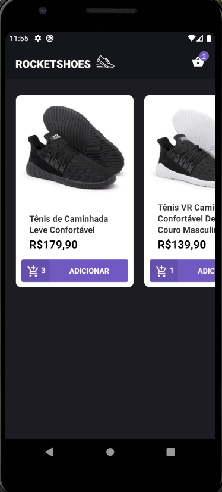
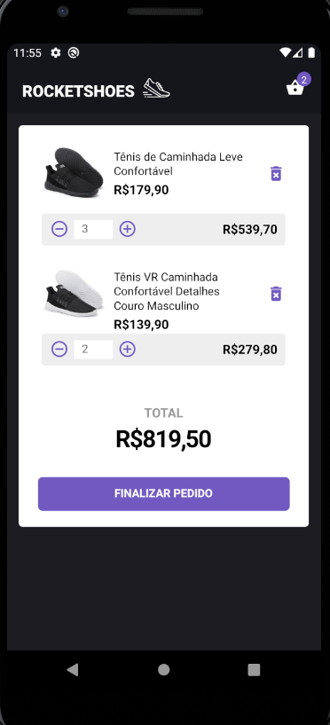

### RockeShoes Mobile

<h3>Aplicativo desenvolvido em React-Native</h3>
<span>Aplicativo de e-commerce simples</span>


<h3>Para executar esse app siga os passos:</h3>

<span>Clone esse repositorio em sua maquina</span>
<span>Abra o emulador de sua escolha, no caso usei durante o Desenvolvimento o Android Studio.</span>

<br/><br/>
<span>Execute o yarn para instalar as dependencias:</span>

```js
    yarn

```

<h5>Tenha instalado no seu ambiente o Json-server, e o React-Native-cli que serão usados durante a execução</h5>


<span>Instalando o app no emulador do Android:</span>

```js
    react-native run-android
```

<span>Instalando o app no emulador do Ios</span>

```js
    react-native run-ios
```

<span>Executando a api pela porta 3333, para abastecer o app</span>

```js
    json-server api.json -p 3333
```
<span>Executando o aplicativo:</span>

```js
    react-native start
```


<h3>Para criação desse aplicativo foram usados as seguintes bibliotecas:</h3>

<ul>
    <li>React-Native</li>
    <li>Redux</li>
    <li>Redux-Saga</li>
    <li>Immer</li>
    <li>Axios</li>
    <li>Reactotron-react-native</li>
    <li>Styled-Components</li>
    <li>Babel</li>
    <li>EsLint</li>
    <li>Prettier</li>
    <li>Entre outras</li>
</ul>







<h3>App Desenvolvido por Fernando Santos, Durante bootcamp RocketSeat</h3>

<a href='https://www.linkedin.com/in/fernando-santos-686632122/'>Linkedin </a>
